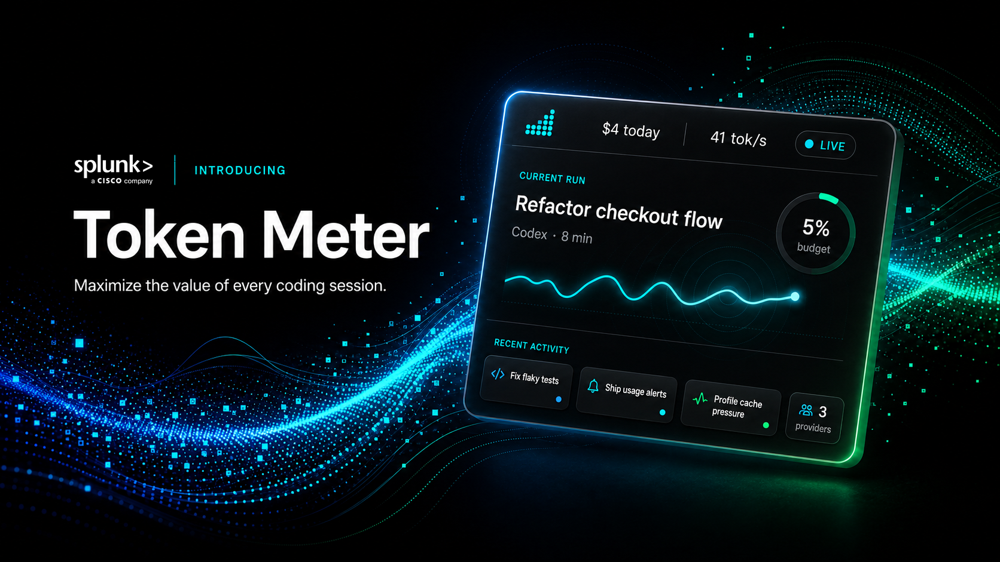
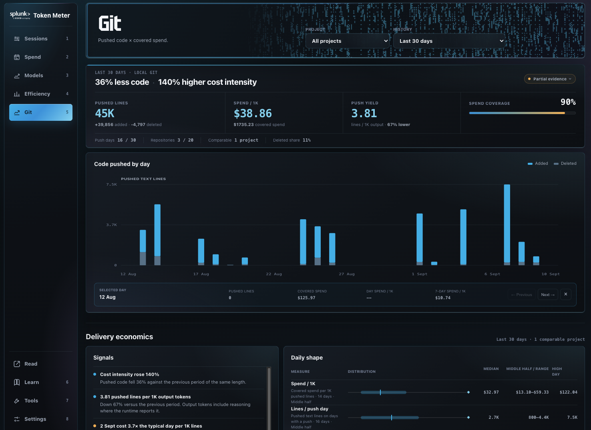

<p align="center">
  
</p>

<p align="center">
  <a href="https://www.splunk.com/en_us/blog/artificial-intelligence/token-meter-a-live-cost-meter-for-your-coding-agents.html">📝 Launch blog</a>
  · <a href="https://splunk.github.io/token-meter/">🌐 Website</a>
  · <a href="https://www.google.com/search?q=site%3Asplunk.com+tokenomics">📚 Learn Tokenomics</a>
</p>

Token Meter is a local-first observability dashboard for AI coding agents. It
turns session evidence from Claude, Codex, Cursor, OpenCode, Kiro, and Pi into one
view of what happened, what it cost, and where time went—so you can decide
whether to continue, intervene, compare, or investigate a run.

Python standard library only. No API keys for trace analysis. No Token Meter
analytics or telemetry leaves your machine.

## Quick Start

### macOS or Linux

```bash
git clone https://github.com/splunk/token-meter.git
./token-meter/scripts/install
```

The installer stages a stable per-user runtime, starts the local server and
native companion, and configures automatic startup.

### Windows

> **Beta:** The Windows extension is still in beta.

```powershell
powershell.exe -NoLogo -NoProfile -ExecutionPolicy Bypass -Command '$p=Join-Path $env:TEMP "token-meter-bootstrap.ps1"; try { Invoke-WebRequest -UseBasicParsing "https://raw.githubusercontent.com/splunk/token-meter/main/scripts/bootstrap-windows.ps1" -OutFile $p; & $p } finally { Remove-Item -LiteralPath $p -Force -ErrorAction SilentlyContinue }'
```

The bootstrap uses WinGet from Microsoft App Installer to install missing Git and Python.
It then stages the beta extension without administrator access. From an
existing checkout, rerun `.\scripts\install-windows.cmd`.

### Open Token Meter

Open [http://127.0.0.1:8722](http://127.0.0.1:8722), start a normal agent run,
and choose it from **Sessions**.

For requirements, development startup, updates, uninstall commands, and
troubleshooting, see the [User guide](specs/USER_GUIDE.md).

**Windows beta uninstall:**
`powershell.exe -NoLogo -NoProfile -ExecutionPolicy Bypass -File "$env:LOCALAPPDATA\Token Meter\runtime\scripts\uninstall-windows.ps1"`

## What You Can Do

| Goal | Token Meter helps you |
| --- | --- |
| **Understand a live run** | Follow estimated cost, tokens, context pressure, wait, output pace, tool calls, execution evidence, and session-budget alerts. |
| **Review history and spend** | Find expensive or slow work across sessions, projects, runtimes, platforms, and calendar ranges. |
| **Compare models and execution** | Compare input, output, pace, wait, and workload shape without presenting weak matches as meaningful results. |
| **Investigate tools and skills** | Find high-output, failing, repeated, unobserved, or deferred capabilities while keeping incomplete evidence explicit. |
| **Improve with Tok** | Ask Tok, Token Meter's token coach, questions from any page, turn a natural-language intention into one measurable goal, and opt into evidence-bounded weekly reviews through your signed-in Codex CLI. |
| **Manage usage** | Check provider-reported limits, allocate a monthly budget, receive threshold notifications, and let Codex or Claude query bounded evidence through the local MCP. |

## Coverage

**Runtimes:** Claude Code and Desktop Agent/Cowork, Codex CLI and desktop,
Cursor Agent/Composer, OpenCode, Kiro, and Pi coding-agent sessions.

| Platform | Status | Experience |
| --- | --- | --- |
| **macOS** | Supported | Browser dashboard and native menu-bar companion |
| **Linux** | Supported | Browser dashboard and AppIndicator tray companion |
| **Windows** | **Beta** | Browser dashboard and notification-area extension |

Evidence varies by runtime and client version. Missing values remain
unavailable instead of appearing as a misleading zero.

Token Meter works when the agent keeps session evidence on your machine in a
supported local store. Sessions that exist only in a cloud-hosted service may
not be available to Token Meter.

For Pi coding-agent sessions, recorded token/cost and structural tool evidence
remain local and content-free. Wait time
is inferred between user and assistant events. Pi leaves semantic token classification
and context-window size unavailable when its records do not provide them.

## First Five Minutes

1. Open **Sessions → Current sessions** and select an active run.
2. Under **Run**, check cost, context pressure, Output/$, and Reasoning ratio.
   Add a session budget if the run needs an attention limit.
3. After more sessions accumulate, use **Spend**, **Models**, **Tools**,
   **Efficiency**, and **Git** to review longer-term patterns.
4. Open **Tok** from the header to ask about the current page or draft one
   measurable improvement goal.

## Product Tour

### Follow a session

Run keeps usage, execution, tool, and budget evidence together on one focused
session page.

<p align="center">
  
</p>

### Understand spend

Compare Today, 7-day, 30-day, This month, or a custom period across platforms,
projects, runtimes, and sessions. Spend concentration, percentile session
shapes, and a clickable cost-or-input versus active-time map expose which runs
deserve inspection.

<p align="center">
  
</p>

### Inspect tools and skills

Review observed calls, output estimates, failures, repeats, catalog exposure,
skill-pack activation, and bounded review candidates.

<p align="center">
  
</p>

### Check token efficiency

Use **Efficiency** to compare four signals over comparable, covered work:

- **Output / $**: reported output tokens per covered dollar. Higher is better
  over time because more output is reaching the response for the spend.
- **Reasoning ratio**: reported reasoning tokens as a share of output. Lower or
  stable is usually better for comparable work, while difficult work may need
  more reasoning.
- **Context load**: processed input tokens per output token. Lower is better
  because less context is carried into each response.
- **Output / execution**: output tokens per covered run. Higher generally means
  a less fragmented workflow.

Each headline includes a daily trend, and partial coverage or unavailable
evidence stays labelled beside the numbers.

<p align="center">
  
</p>

### Set a measurable goal with Tok

Tok is one shared right-side conversation across the dashboard, not a set of
tabs. It can use the current page name and bounded, content-free Token Meter
evidence; messages stay in browser memory and disappear on refresh. A reply
starts with one content-free live line carrying a spinning indicator, the stage,
and a visual-only timer. The stage reads **Starting Tok**, then **Opening
Codex**, the Token Meter reading actually in progress such as **Reading your
usage history**, or **Checking the evidence**—only when those observed
boundaries occur. Once a Token Meter reading completes the line counts it, and a
run past roughly twenty-five seconds adds that Tok is still working—an
elapsed-time statement that claims no cause for the delay. After eight
seconds the send control becomes **Stop**, which ends only that active Tok turn;
the sent message remains and the panel offers **Retry**. Provider response time
is variable, and Tok never exposes model reasoning, raw events, or fabricated
progress.

Failures are visible, not silent. A request that cannot be delivered becomes a
clearly marked error entry with **Retry** rather than words in Tok's voice, and a
missing local prerequisite—such as a Codex CLI that is not installed—appears as a
notice naming what to do, with a quiet attention dot on the closed **Tok**
control.

Describe an improvement in ordinary language, review the structured metric,
target, evidence window, runtime, and weekday that Codex drafts, then explicitly
activate it. One active goal appears as a compact rail below the composer; open
it for progress, weekly controls, and the saved review. Token Meter stores that
contract and numeric snapshots—not your wording or Codex's prose. Answers show
one collapsed source line with at most three content-free measurements, rather
than an expanded evidence table.

Weekly reviews are opt-in. When enabled, the signed-in local Codex CLI compares
the saved baseline with current covered evidence once on the selected weekday.
You can pause weekly reviews, run one manually, or clear the goal from the same
panel. Progress stays unavailable while a baseline is being collected or when
required evidence is missing.

### Git

**Git** pairs successful local pushes with covered spend, so you can see code
changed by project and day. It uses local `git` evidence only—never remote
requests—and clearly marks partial or unavailable coverage. It is a mechanical
signal, not a code-quality or productivity score.

<p align="center">
  
</p>

### Configure budgets and agent access

Manage monthly budgets, model pricing, language signals, native preferences,
and local read-only connections for Codex and Claude. Software update checks
and automatic installation are separate settings; both are on by default.

<p align="center">
  
</p>

The local MCP exposes eight read-only tools:

| Tool | Use |
| --- | --- |
| `check` | Make a bounded decision about the caller-matched current run. |
| `usage` | Review aggregate spend, model, tool, or change evidence. |
| `capabilities` | Review optional user-installed skill-pack evidence. |
| `sessions` | Select content-free session IDs using runtime, client, model, state, or time filters. |
| `trace` | Read a standardized trace or sanitized runtime-native structure for one session. |
| `stats` | Aggregate selected token, cost, timing, context, attempt, model-call, or tool metrics. |
| `goal` | Read the active structured Tok goal, progress, or latest numeric weekly review. |
| `schema` | Discover fields, dimensions, units, limits, and availability semantics. |

A comparison harness can call `sessions`, pass one returned ID to `trace`, and
then call `stats` with dimensions such as `runtime`, `model`, `day`, or
`session_id`. List responses expose `page.next_cursor`; continue by replaying
the same query with that cursor. Metrics retain measured, estimated, inferred,
and unavailable coverage, so missing evidence is not silently treated as zero.

The `native_structure` trace view is not raw trace content. It keeps only
allowlisted event types/subtypes, model and tool identities, statuses,
relationships, timestamps, and numeric evidence. It does not expose raw trace
content, prompts, responses, reasoning text, tool payloads, or trace paths.

### Check without opening the dashboard

Use the macOS menu bar, Linux tray, or beta Windows extension to reach the
current or pinned run. The native clients read a compact local payload and do
not parse traces or read provider credentials directly. Token Meter checks for
updates every 10 minutes and installs safe `main` updates automatically by
default, so normal updates do not require opening the dashboard. If automatic
installation is off, the native menu shows **New update available** instead.

<p align="center">
  
</p>

## Evidence and Privacy

Token Meter reads local runtime stores and binds its dashboard to `127.0.0.1`.
It does not upload traces, prompts, responses, project paths, token counts,
costs, or derived analytics. Do not expose the localhost dashboard publicly.

Costs and selected token values can be estimates. Codex cost uses public
API-equivalent rates, which can differ from subscription billing; Cursor usage
includes local proxies where authoritative values are unavailable; Pi cost are
estimates based on model API pricing.

The optional MCP returns bounded derived evidence, not prompts, responses,
reasoning, tool contents, credentials, settings, or trace paths. A result sent
to an explicitly connected agent may be processed by that client's model
provider under its own terms. See the [User guide](specs/USER_GUIDE.md) for the
full evidence semantics and [Security policy](specs/SECURITY.md) for the
canonical boundary.

Tok uses the user's existing Codex CLI sign-in. Each turn runs in an
ephemeral, read-only workspace with general shell, file, browser, app, plugin,
memory, and sub-agent tools disabled; only allowlisted read-only Token Meter MCP
tools are exposed. Coach-launched MCP calls can reuse the running local server's
bounded warm evidence path and fall back once to the existing local read when
that optimization is unavailable; the result contract and allowlists do not
expand. The message you send and the bounded MCP results selected for the answer
may be processed by OpenAI under that account's terms. Tok never receives raw
trace content, and Token Meter never stores the conversation or model reasoning.

## Documentation

| Document | Use it for |
| --- | --- |
| [User guide](specs/USER_GUIDE.md) | Requirements, daily use, MCP, updates, uninstall, evidence semantics, and troubleshooting |
| [Security](specs/SECURITY.md) | Privacy and security boundaries or vulnerability reporting |
| [Architecture](specs/ARCHITECTURE.md) | Components, data flow, runtime adapters, and extension contracts |
| [Contributing](specs/CONTRIBUTING.md) | Issues, pull requests, development, and validation |
| [Product principles](specs/PRODUCT.md) and [visual design](specs/DESIGN.md) | Product and experience decisions |
| [Specifications and plans](specs/) | Maintained feature designs and implementation plans |

## License

MIT. See [LICENSE](LICENSE).
