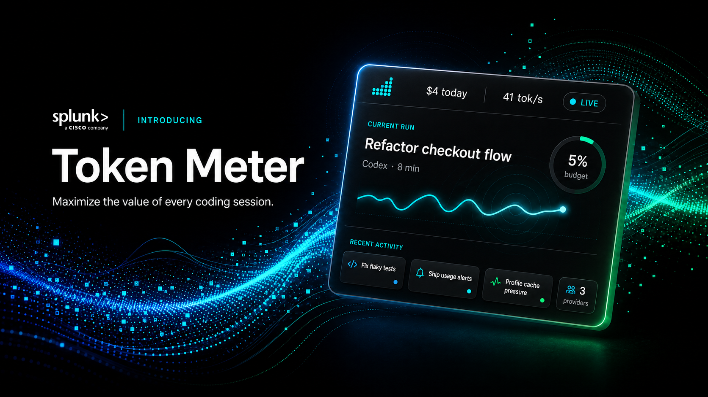
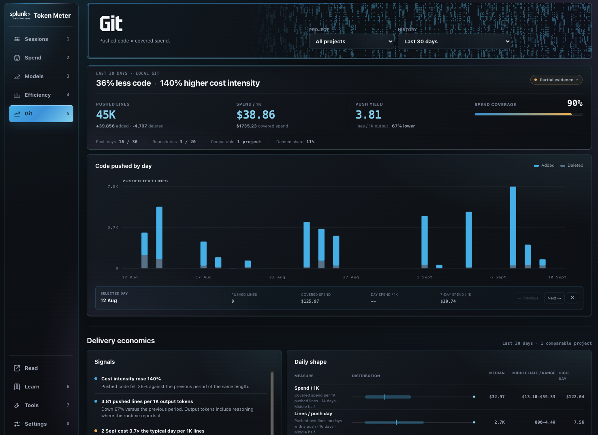

<p align="center">
  
</p>

<p align="center">
  <a href="https://www.splunk.com/en_us/blog/artificial-intelligence/token-meter-a-live-cost-meter-for-your-coding-agents.html">📝 Launch blog</a>
  · <a href="https://splunk.github.io/token-meter/">🌐 Website</a>
  · <a href="https://www.google.com/search?q=site%3Asplunk.com+tokenomics">📚 Learn Tokenomics</a>
</p>

Token Meter is an open-source, local-first usage and cost dashboard for AI
coding agents. It shows token usage, estimated cost, context pressure, time, and
tool activity for **Claude, Codex, Cursor, OpenCode, Kiro, and Pi** in one place.

- **Local only.** Python standard library, no API keys, no telemetry.
- **Honest numbers.** Estimates are labelled; missing evidence stays unavailable, never zero.

## Quick Start

### macOS or Linux

```bash
git clone https://github.com/splunk/token-meter.git
./token-meter/scripts/install
```

This starts the local server and native companion, and enables automatic
startup. Add `--backend-only` to skip the menu-bar/tray companion.

### Windows

> **Beta:** the Windows extension is still in beta.

```powershell
powershell.exe -NoLogo -NoProfile -ExecutionPolicy Bypass -Command '$p=Join-Path $env:TEMP "token-meter-bootstrap.ps1"; try { Invoke-WebRequest -UseBasicParsing "https://raw.githubusercontent.com/splunk/token-meter/main/scripts/bootstrap-windows.ps1" -OutFile $p; & $p } finally { Remove-Item -LiteralPath $p -Force -ErrorAction SilentlyContinue }'
```

The bootstrap uses WinGet (App Installer) to add any missing Git and Python,
with no administrator access. From a checkout, run `.\scripts\install-windows.cmd`.
Add `-BackendOnly` (`& $p -BackendOnly`) to skip the notification-area companion.

Uninstall:
`powershell.exe -NoLogo -NoProfile -ExecutionPolicy Bypass -File "$env:LOCALAPPDATA\Token Meter\runtime\scripts\uninstall-windows.ps1"`

### Open the dashboard

Go to [http://127.0.0.1:8722](http://127.0.0.1:8722), start an agent run, and
pick it under **Sessions**. Requirements, updates, uninstall, and
troubleshooting are in the [User guide](specs/USER_GUIDE.md).

## Platforms

| Platform | Status | Companion |
| --- | --- | --- |
| macOS | Supported | Menu bar |
| Linux | Supported | AppIndicator tray |
| Windows | Beta | Notification area |

Runtimes: Claude Code and Desktop (Agent/Cowork), Codex CLI and desktop, Cursor
Agent/Composer, OpenCode, Kiro, and Pi. Only sessions stored locally are visible.

## Features

### Follow a session

Live cost, tokens, context pressure, output pace, tool calls, session budgets,
and child-agent activity on one page.

<p align="center">
  
</p>

### Understand spend

Compare any period across platforms, projects, runtimes, and sessions to find
the runs worth inspecting.

<p align="center">
  
</p>

### Check efficiency

| Signal | Meaning | Better |
| --- | --- | --- |
| **Output / $** | Output tokens per dollar | Higher |
| **Reasoning ratio** | Reasoning share of output | Lower or stable |
| **Context load** | Input tokens per output token | Lower |
| **Cache hit ratio** | Cache-read share of input | Higher |

<p align="center">
  
</p>

### Inspect tools and skills

Spot high-output, failing, repeated, or unused tools and skill packs.

<p align="center">
  
</p>

### Work

**Work** shows what the spend went into. It is available on macOS only. When
you turn on **Settings → Work insights**, a local decision model
([Winnow-E4B](https://huggingface.co/EldanRing/Winnow-E4B), Apache-2.0, built on
Google's Gemma 4 E4B) running in your own Ollama labels each request's area,
work type, and complexity, and flags follow-up turns where you pushed back on
the previous work. The page shows:

- **Right-sizing**: suggestions for spending less on models without losing
  results, such as a cheaper model that resolves the same kind of work as often,
  a standard model for routine work, lower reasoning effort, or starting fresh
  sessions sooner. Each shows an estimated saving.
- **Where the spend went** by area, with a trend line per area, and **how
  sessions ended**: accepted, recovered after pushback, or ended on pushback.
- **Session tags** such as Marathon, Long thread, Big spender, Subagent team, Overkill,
  Rescued, and One-shot, each with its spend and resolved share.
- **When you work**: session starts by weekday and hour, and pushback by time
  of day.
- **Pushback over time** and **cost per resolved session** by kind of work.
- **Model choices**: a scorecard of your top models by spend.

Turning Work insights on sets everything up in the background. If this Mac has
no Ollama 0.34 or newer running, Token Meter downloads a pinned, signed Ollama
0.34.4 into its own Application Support folder and runs it on 127.0.0.1 only.
It then downloads the Winnow-E4B model (an 8-bit file of about 8 GB, every file
checked against a pinned hash), adds it to Ollama, and deletes the download.
Setup needs about 17 GB free while it runs and about 8 GB after, and the model
uses about 8 GB of memory while it labels. If an update changes the model,
Token Meter asks on the Work page before downloading it. Progress shows on the
Work page; turning Work insights off stops the managed Ollama, and uninstalling
Token Meter removes it.

Labeling is off by default, runs in the background at a gentle pace (5 labels a
minute unless you raise it), pauses on battery, and can be paused from the page,
Settings, or the menu bar. Labels are estimates; low-confidence answers show as
Unclear.

### Git

Pairs local pushes with spend to show code changed per project and day, using
local `git` only. A mechanical signal, not a productivity score.

<p align="center">
  
</p>

### Subagents

Track spend, cost per run, and volume for each named child-agent role, and
drill into individual runs from **Sessions → Subagents**.

### Budgets, settings, and MCP

Set monthly and per-session budgets, edit model pricing, and connect Codex or
Claude to the local MCP: eight read-only evidence tools (`check`, `usage`,
`budget`, `capabilities`, `sessions`, `trace`, `stats`, `schema`) plus two
session-budget setters that require `confirm: true`. Traces are allowlisted
structure and numbers, not raw trace content. See the
[User guide](specs/USER_GUIDE.md#ask-from-codex-or-claude) for details.

<p align="center">
  
</p>

### Menu bar and tray

See the current run without opening the dashboard. Updates are checked every
10 minutes and installed automatically by default.

<p align="center">
  
</p>

## Privacy

- The dashboard binds to `127.0.0.1`. Do not expose it publicly.
- Traces, prompts, responses, paths, and analytics never leave your machine.
- The MCP returns derived numbers only. Agents you connect may send them to their model provider.
- Costs are estimates. Codex uses public API rates, which can differ from subscription billing.
- Work insights, when on, send typed prompts, the end of the reply before each one, uploaded and
  changed file names only to the local Ollama you choose; Token Meter stores labels and counts, never text.

Full details: [User guide](specs/USER_GUIDE.md#data-and-evidence) ·
[Security policy](specs/SECURITY.md).

## Documentation

| Document | Covers |
| --- | --- |
| [User guide](specs/USER_GUIDE.md) | Setup, daily use, MCP, updates, troubleshooting |
| [Security](specs/SECURITY.md) | Privacy boundaries, vulnerability reporting |
| [Architecture](specs/ARCHITECTURE.md) | Components, data flow, extension contracts |
| [Contributing](specs/CONTRIBUTING.md) | Issues, pull requests, validation |
| [Product](specs/PRODUCT.md) · [Design](specs/DESIGN.md) | Product and experience decisions |

## License

MIT. See [LICENSE](LICENSE).
