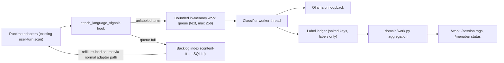

# Work Insights Design

Status: historical design log (2026-09-30 onward), one section per iteration.
For how the Work page behaves now, see [WORK_INSIGHTS.md](WORK_INSIGHTS.md).

## Goal

Answer "what did the spend accomplish?" alongside "how much was spent?".
A local decision model labels each session's work so Token Meter can show
activity allocation, workstreams, rework, cost per kind of work, and model
right-sizing. Tokens are an input cost; these labels are the missing outcome
and quality evidence.

## Decisions

| Topic | Decision |
| --- | --- |
| Placement | New top-level **Work** page between Efficiency and Git. Order becomes `Sessions → Spend → Models → Subagents → Efficiency → Work → Git → Learn → Tools → Settings`. |
| Taxonomy | Two axes. A fixed **work type** (see iteration 9 for the current ten) owned by Token Meter, plus user-editable **areas** (2–8, name and one-line description) in Settings. Eight is the validated categorical palette limit. |
| Model | Jet v6.2 (Apache-2.0, Qwen3.5-4B decision model) served by the user's local Ollama. Model name and loopback URL are configurable. |
| Provisioning | Off by default. Turning it on runs `token_meter/services/work_setup.py` (iteration 8), which reuses or installs a pinned Ollama and imports the pinned Jet model; `scripts/setup-work-classifier` runs the same module. |
| Scope v1 | Classifier infrastructure, Work page, session tags, Settings controls, menu-bar pause, setup script. |
| Scope v2 | Session outcome joined with Git delivery, prompt-clarity coaching, live menu-bar nudge, MCP exposure, "spend rising while value is flat" alert. |

## Architecture

### Units

| Unit | Responsibility |
| --- | --- |
| `token_meter/services/work_insights.py` | Settings normalization, text cleaning and skeleton compression, label ledger, queue and backlog, pacing and throttle, Ollama client, worker lifecycle. No trace parsing. |
| `token_meter/domain/work.py` | Pure aggregation of cached session summaries plus ledger labels into allocation, workstreams, work-type economics, rework, and right-sizing. No I/O. |
| `token_meter/app.py` | Composition only: hook call, service singleton, watcher registration, HTTP routes, projections. |
| `page.html` | Work page, Settings → Work insights, session tag chips. |
| `menubar/TokenMeterMenuBar.swift` | Pause and resume item driven by the compact payload. |

### Hook and turn identity

`attach_language_signals(row, rollups, events)` already runs for every parsed
source with the adapter's human-turn list. The analysis step passes the turns
through a private field that the hook consumes and deletes before the row is
cached, so text never lives on a summary row.

- `session_key = sha256(salt ‖ row.id)[:24]`
- `turn_key = sha256(salt ‖ row.id ‖ ordinal ‖ sha256(text))[:32]`

Keys are salted with a per-machine random salt stored in the ledger, so they
are not reversible to sessions or text. Session-level questions (work type,
area, complexity) use the session's first human turn. Every later turn gets one
yes/no question: did the user say the previous work was wrong, broken, or not
what they asked for? The previous assistant message tail (600 characters,
cleaned) is included as context for that question.

Answer readout, chosen from the evaluation below:

- Choice questions (work type, area) are asked in the original and reversed
  option orders and the two distributions are averaged, cancelling position
  bias.
- Complexity uses the probability-weighted level rather than the top label.
- Confidence below 0.5 projects as Unclear (complexity excepted).

### Queue, backlog, and priority

- The work queue holds at most 256 cleaned, skeleton-compressed items
  (≤ 2,000 characters each). Duplicate keys are ignored.
- When the queue is full, only a content-free backlog row
  `(source_key, newest_ts, pending_count)` is written.
- At the low-water mark (64 items), the worker asks the application to
  invalidate the next backlog source's summary. The watcher re-loads it through
  the normal adapter path, which re-enqueues its unlabeled turns. No new adapter
  method is added and text never touches disk.
- Priority: sources active in the last 10 minutes first, then newest to oldest.
  Backfill horizon defaults to 90 days (options: 30, 90, 365, all).

### Text preparation

1. Strip runtime-injected wrappers: memory citations, file-citation directives,
   image tags, and "Files mentioned by the user … My request:" prefixes.
2. Skeleton compression for text over 2,000 characters: first 1,200 characters,
   headings and first lines of list items within budget, runs of log or code
   lines collapsed to `[N lines of pasted log/code]`, then the last 500
   characters.
3. The Jet prompt: fixed system prompt, `<state>` block, labeled options,
   one-token label readout, per-type temperature from Jet's `calibration.json`
   (`choice` 1.122, `score` 1.155, `noul` 1.542).

## Pacing, pause, and throttle

- One daemon worker, sequential requests, `num_ctx` 4,096, `keep_alive` 2 min so
  the model unloads when idle. Nothing in `/state`, `/session`, or `/menubar`
  waits on inference.
- Rate limit: token bucket, default 5 requests per minute (choices 5, 10, 20, 40, 60) so low-end laptops stay responsive, 250 ms minimum gap.
  Current-session items bypass the backlog queue but share the limit.
- Manual pause from Settings, the Work page header, or the menu bar:
  1 hour, until tomorrow (local 06:00), or until resumed. The worker checks
  pause, enablement, and the rate limit before every model request, so a
  session opener's calls are spaced rather than burst; the in-flight request
  (bounded by its timeout, typically under 2 s) completes, then a
  `keep_alive: 0` request unloads the model.
- Automatic throttle, re-evaluated before each request. Any hit sets state
  `throttled` with a reason and waits 60 s:
  - load average per CPU above 0.75 (skipped where unavailable);
  - on battery power when "Pause on battery" is on (default on; macOS reads
    `pmset -g batt` with a 2 s timeout; unknown means no signal);
  - median latency of the last 10 requests above 3× the rolling baseline.

## Failure handling and retries

| Failure | Classification | Behavior |
| --- | --- | --- |
| Connection refused, DNS, timeout | Transport | Circuit breaker: exponential backoff 5 s × 2ⁿ, cap 10 min, ±20% jitter. Probe `GET /api/version`. Items keep their attempt count. |
| HTTP 404 or "model not found" | Setup | State `setup_needed` with reason `model_missing`; probe `/api/tags` every 60 s. |
| HTTP 5xx, out of memory | Transport | Same backoff as transport. |
| HTTP 400, no usable label in logprobs | Item | Attempt +1; a content-free backlog row schedules a re-load after 1 min, 10 min, 1 h; after 3 attempts record terminal `unclassifiable` with a reason code. Shown as Unclear. |
| Ledger I/O error | Storage | State `storage_error`; worker stops writing and retries every 5 min. Incompatible schema is moved aside and recreated, like the Git ledger. |
| Worker exception | Internal | Supervisor loop logs a sanitized reason code (no text, no exception message), sleeps with backoff, restarts. |
| Model digest changes | Version | Before every model request the worker re-reads the local `/api/tags` entry, so a changed digest or a name re-pointed to a remote or cloud model is caught before the next request. New labels record the new digest; existing labels stay valid. Relabeling with a new model is v2. |
| Areas edited | Taxonomy | Area labels carry a taxonomy hash. Stale area labels count as Pending and are re-queued newest first. Work type and turn labels are unaffected. |

Request timeouts: connect 2 s; read 10 s plus 1 s per 1,000 prompt characters,
capped at 60 s. Labels are idempotent upserts keyed by `(turn_key, question)`.
Confidence below 0.5 is projected as **Unclear**, never as a category.

Worker states exposed to clients: `disabled`, `setup_needed`, `running`,
`idle`, `paused`, `throttled`, `backoff`, `storage_error`, each with a
bounded reason code, pending and labeled counts, and an ETA.

## Work page

Filters: period (last 3, 6, or 12 months, or all), runtime, project.
The header shows state, coverage ("Labeled 62% of turns in this period"),
pending count, ETA, and a Pause menu. Every module states that labels are
estimates from a local model.

1. **Monthly activity allocation.** A 100% stacked bar per month by area with a
   measure selector (user turns, sessions, spend). Pending and Unclear are
   explicit segments. Month totals on the right; partial months are marked.
2. **Workstreams.** For a selected month: project × area rows with turns,
   share, sessions, spend, rework rate, and dominant work type.
3. **Work type economics.** Per work type: sessions, spend, cost per session,
   median turns, rework rate.
4. **Rework.** Correction rate by week and by runtime-scoped model. Rates with
   fewer than 20 turns show "few samples".
5. **Right-sizing.** A complexity (routine, everyday, complex, high-impact) ×
   model price tier (light, standard, premium) grid. Tiers are terciles of the
   user's observed runtime-scoped models by catalog output price. Each cell
   shows spend, sessions, and rework. Premium-on-routine spend is labeled
   "possible overspend (estimate)". Light-on-complex with rework above the
   user's median is labeled "possible false economy".

Sessions → selected session shows tag chips: area, work type, complexity, and
correction count.

Settings → Work insights: enable toggle with the privacy explanation, status
and setup command, pause controls, pause on battery, rate, backfill horizon,
areas editor (2–8 areas, name ≤ 40 characters, description ≤ 160 characters,
reset to defaults), and "Delete all labels" with confirmation.

## Outcome insights (iteration 2)

All derived from existing labels; no extra model calls.

- **Session outcomes.** Using the ordered pushback labels on follow-up turns:
  single request (no follow-ups), accepted without pushback, recovered after
  pushback (last labeled follow-up is not pushback), ended on pushback (last
  labeled follow-up is pushback), or not labeled yet. Spend and cost per session
  per outcome.
- **Spent after first pushback (estimate).** Session cost × share of the
  session's turns after its first pushback, summed.
- **Pushback by turn position.** Rate for follow-up ordinals 1–2, 3–5, 6–10,
  11–20, 21+; flat means long sessions are not drifting.
- **Model fit by work type.** Pushback rate and cost per session for each work
  type on the five most-used runtime-scoped models; "Best" marks the lowest
  pushback per row only when at least two models have 20+ labeled turns.
- **What stands out.** Up to four deterministic cards, warn first: sessions
  ending on pushback (≥ 10%), possible right-sizing savings (premium-on-routine
  spend × standard/premium median output price), rework spend (≥ 10% of
  spend), pushback trend month over month (≥ 3 points, both months 20+ turns),
  the biggest area share shift (≥ 10 points), and the costliest work type
  (≥ 1.5× the median). Every card needs 20+ labeled sessions where it uses
  rates and links to the module that supports it.

## Drill-down, operating rhythm, and prompt v2 (iteration 3)

- **Sessions behind any number.** Allocation segments, workstream rows, work
  types, outcomes, rework models, model-fit, right-sizing, and effort cells open
  a sessions panel (`GET /work/sessions`, allowlisted fields, top 50 by spend,
  same windowing and labels as the aggregates). `#work-sessions?<filters>` deep
  links to it. Filters are validated against fixed enums, the configured areas,
  `YYYY-MM` months, and known project labels.
- **Right-size reasoning.** A complexity × reasoning-effort table; xhigh, max, or
  ultra effort on routine requests is flagged as possible overthinking.
- **More headline cards.** Cost per resolved (accepted or recovered) session vs
  sessions that ended on pushback; "spend rose while resolved sessions stayed
  flat" (last two complete months, spend +25% or more, resolved +5% or less, 20+
  resolved sessions in the earlier month); spend on high-effort routine work.
- **Prompt version p2.** Every label stores the prompt version. Stale labels keep
  classifying until the worker relabels them, and current labels win.
  "Pending" means follow-up turns that have never been labeled.
- **Turn preparation.** Codex follow-ups now carry the preceding assistant
  message (current rollouts store it as `response_item` messages). Leading
  runtime wrappers ending in "My request:" are stripped; continuation summaries
  and attachment-only turns are skipped; sessions are labeled from their first
  substantive turn (three or more words), not a greeting.
- **Options and cutoffs.** `debug` includes install or setup errors; `ops` is
  running git, release, or install commands or machine upkeep without changing
  code; the default "Operations and setup" area is machine upkeep not tied to a
  product codebase. Work type uses a 0.35 Unclear cutoff; area and pushback
  stay at 0.5.

### Live-label audit (2026-09-30)

An independent agent labeled a blind stratified sample from the live ledger
(55 sessions, 95 unambiguous follow-up turns): area 92% and work type 93%
correct at confidence ≥ 0.7; complexity 76% exact and 100% within one level;
pushback precision 0.87 (0.96 / 0.93 precision / recall at confidence ≥ 0.7)
and recall about 0.77; 15 of 20 session outcomes matched. It found the Codex
missing-context bug and the wrapper leaks above.

Changes were tested on the 180-turn ground truth before adoption. Adding
"asking for new changes, giving the go-ahead, or reporting a pre-existing bug
is not a correction" to the pushback question dropped precision from 0.81 to
0.45, so it was rejected. The narrowed `ops`/`debug` options kept accuracy
(50/60) with more confident answers (38 at ≥ 0.7, 92% correct). A 0.35 work-type
cutoff labels 58 of 60 sessions at 84% vs 51 at 86%. Rewording "routine"
complexity changed nothing and was not adopted.

## Page redesign (iteration 4)

The page tells one story, spend in and outcomes out:

1. **Period KPIs**: resolved sessions (accepted or recovered, over sessions with
   labeled follow-ups), pushback rate, cost per resolved session, and spend after
   first pushback, each against the equal period before when one exists.
2. **What stands out** cards.
3. **Spend in, outcomes out**: one vertical column per month. Above the line,
   the chosen measure (spend, turns, or sessions) stacked by area; mirrored below,
   the outcomes of sessions started that month. Month names with the year shown
   once, and "so far" for the current month. Every segment and key row opens the
   matching sessions in Sessions → All sessions with a removable "Work:" filter
   chip (`#sessions-all?work=1&…`, resolved through `/work/sessions?ids=1`).
4. **Pushback over time** (weekly rate with a model filter; hollow points are
   under 20 labeled turns) beside **cost by kind of work** (per-session cost bars).
5. **Model fit by work type** and **model right-sizing** (price tier and
   reasoning effort).

Workstreams (project × area tables) were removed: the ledger's click-through
answers the same question with the actual sessions.

Labels are keyed per trace file (session id plus trace path, salted), because
one Codex session id can span several rollout files. Drill-downs return session
ids, matching the All sessions list. The ledger schema moved to version 3 to
drop labels keyed by id alone.

## Less but more useful (iteration 5)

Every module now answers one decision, and nothing restates another:

- KPIs: resolved share, pushback rate, cost per resolved session, and spend on
  unresolved sessions (last labeled follow-up was a pushback). The earlier
  "spent after first pushback" estimate assumed every later turn was rework and
  was dropped.
- At most three headline cards, only for change or opportunity: spend up while
  resolved sessions stay flat, pushback trend, the largest right-sizing
  opportunity, long-session drift (turns 11+ at 1.5× the first two follow-ups),
  area share shift, and a kind of work whose resolved sessions cost 2× the
  median.
- The ledger's lower half shows judged outcomes only; single-request and
  not-yet-labeled sessions are counted in the note.
- **Value by kind of work**: cost per resolved session and resolved rate per
  work type (rows with fewer than five judged sessions are dimmed).
- **Model choices**: per work type, a model that needed at least 3 points less
  pushback than the most-used one, both with 20+ labeled turns; the full matrix
  is behind a toggle.
- **Right-sizing opportunities**: premium models on routine work (with a
  standard-tier estimate), very high reasoning effort on routine work, and light
  models on complex work with above-median pushback, ranked by spend; the grids
  are behind a toggle.
- The turn-position strip was removed as a module; it only surfaces as the drift
  headline when it matters.

## Privacy

- User-turn text and the preceding assistant-reply tail (600 characters) exist
  only in process memory, only for unlabeled turns, only while queued, and are
  sent only to the configured loopback Ollama URL.
- The Ollama URL must be `http` with host `127.0.0.1` or `::1`; `localhost`
  is stored as `127.0.0.1`. Redirects are refused. Models whose Ollama entry
  reports a remote host or a cloud tag are refused (`remote_model`).
- Turn keys are salted hashes of session identity and position only, never of
  text, so stored keys cannot confirm guessed prompts.
- The service and its ledger are not created until the feature is enabled.
- The ledger stores salted keys, enum labels, confidences, model digest,
  taxonomy hash, timestamps, and reason codes. Area names are user settings.
- Logs and API errors use reason codes only.
- `/work` and session tags are allowlisted aggregates and enums. No text,
  paths, or keys are projected. Project labels follow existing projections.
- Disabling the feature stops the worker and clears the queue. "Delete all
  labels" removes the ledger file and rotates the salt.

## Testing

- Service unit tests with an in-process fake Ollama: success, logprob parsing
  for each question type, model missing, connection refused with backoff and
  circuit probe, malformed response retry to terminal, pause and resume,
  throttle signals with injected clock and load, rate limit, queue bound and
  backlog refill, taxonomy change re-queue, model digest change.
- Privacy tests: the ledger file contains no sample text; `/work` and session
  payloads contain no text; non-loopback URLs are rejected.
- Settings validation: bounds, idempotent writes, migration from absent keys.
- Domain tests: allocation by each measure, Unclear and Pending handling,
  workstreams, rework minimum samples, right-sizing tiers.
- UI: embedded JS parse, route and order contracts, browser checks at wide
  desktop and 1,024 px.
- Native: Swift compile, smoke output, live menu-bar pause check.
- Installed runtime: install, `/health`, `/menubar`, manifest parity.

## Evaluation

Local evaluation, 2026-09-30, Jet v6.2 int4 in Ollama 0.34.4 on Apple
Silicon. Inputs: 1,836 unique human turns (1,390 follow-ups, 444 session
openers) from local Claude and Codex traces; subagent sessions and injected
messages excluded. Ground truth: 180 turns (90 random follow-ups, 30 likely
corrections, 60 openers) labeled blind by the implementing agent from
redacted, truncated text; genuinely ambiguous turns accept either reading.

| Signal | Result |
| --- | --- |
| Work type (8 classes, order-averaged) | 83% (50/60); 89% when confidence ≥ 0.6 |
| Correction yes/no with context | precision 0.81, recall 0.79, F1 0.80 |
| Correction yes/no without context | F1 0.78 |
| Complexity, probability-weighted | 62% exact; 97% within one level |
| Reversed option order changed the answer | 24% of choice answers |
| Skeleton vs full text on 49 long prompts | same correction label 49/49, same work type 22/24, ~37% fewer tokens |
| Median latency on real turns | ~0.7 s under 500 characters; 1.4 s on long prompts |

Rejected alternatives: a five-way turn-type question (78% accuracy, position
bias, and not needed for any projected metric); an expanded "pushing back"
correction wording (precision fell to 0.67); OR-combining correction
detectors (precision 0.67). A lexical baseline agreed with Jet on only 28 of
233 detected corrections and missed 179, so rework cannot come from phrase
matching alone.

These figures come from one user's sessions and one labeler; treat them as a
smoke-level baseline, not a benchmark.

## Iteration 6: short ranges, model and sizing stats, product palette

- History adds 1 day, 1 week, and 1 month. Traces carry only day-level timestamps, so these use daily buckets (today; last 7 days; last 30 days) and compare with the same span just before. The payload reports `grain` (`month` or `day`); month-over-month headline cards run only at month grain, and the pushback trend plots daily points for short ranges.
- "Value by kind of work" is now "Cost per resolved session", named for what it measures.
- Model choices is a model scorecard (sessions, spend, pushback meter, resolved share, cost per resolved session, scoped by runtime) beside paired usual-versus-alternative pushback bars for each kind of work.
- Right-sizing shows spend by complexity as 100% bars split by model tier and by reasoning effort, stripes the mismatched segments, and totals mismatched spend and the estimated saving above a compact issue table. The detailed grids stay behind "View as tables".
- Area colours are the product's own hues stepped into the dark-chart lightness band and ordered with the dataviz validator (all checks pass; worst adjacent colour-blind ΔE 13.2). Outcomes use the status colours with labels; tiers and effort use single-hue cyan and violet ramps; the trend uses the product cyan.

## Iteration 7: highlights, session tags, rhythm, area trends

All additions come from cached summary rows and existing labels; nothing new is
sent to the classifier.

- `tags`: deterministic per-session tags (`marathon`, `big_spend`, `team`,
  `overkill`, `underpowered`, `rescued`, `stuck`, `one_shot`) with counts,
  spend, share, and resolved rate. Relative thresholds are strictly above the
  90th percentile of sessions started in the period, with at least 10 sessions;
  Marathon also needs one hour of active time. Child runs are counted by
  walking agent `parent_id` chains to the root agent. Drill filter `tag`; drill
  rows carry `tags`.
- `rhythm`: session starts by local weekday and hour (from `start`) and
  pushback by time-of-day band.
- Area rows draw a sparkline from the existing allocation buckets when the
  period has at least three.

## Iteration 8: right-sizing first, efficiency suggestions, hands-off setup

- The KPI tiles and highlights were removed; Right-sizing is the first module.
- `recommendations`: ranked suggestions with `saving` estimates (`premium_routine`,
  `effort_routine`, `light_complex` from the right-sizing cells, plus
  `switch_model` per work type and `long_threads`), each with at least three
  sessions. A `long_thread` tag (30+ requests) backs the long-thread drill.
- `token_meter/services/work_setup.py` runs when Work insights are turned on and
  at server start: it reuses a reachable Ollama 0.34+ or installs pinned Ollama
  0.34.4 (archive SHA-256 and Apple team ID `3MU9H2V9Y9` checked; safe tar
  extraction) under `~/Library/Application Support/Token Meter/ollama`, runs it
  as LaunchAgent `com.token-meter.ollama` on 127.0.0.1:11435 with logs sent to
  /dev/null, downloads the pinned Jet files with resume and per-file hashes,
  checks free space first, imports with `-q int4`, and deletes the download.
  Status exposes only a state, a reason code, and byte counts.
  `scripts/setup-work-classifier` runs the same module.

## Iteration 9: developer taxonomy (work type and area prompt v3)

- Work types: feature, debug (bug fixing), refactor, test, review (code
  review), plan (planning and design), explore (questions and research), ops
  (DevOps and setup, including install and dependency errors), docs, other.
- Default areas follow the software stack: Frontend & UI, Backend & APIs,
  Data & ML, Infrastructure & DevOps, Developer tooling & agents, Docs &
  writing, Non-code. Settings that still hold the previous default area names
  move to these; custom areas are kept.
- Labels carry per-question versions (`QUESTION_VERSIONS`). Work type and
  area moved to `p3`, so only those are relabeled; complexity and pushback
  labels stay valid. Stale labels keep showing until replaced.
- Evaluation, 2026-10-01, Jet v6.2 int4 in Ollama 0.34.4: 82 synthetic
  developer requests written for this purpose (no user text). Work type: the
  previous wording 87% (71/82, scored against the old classes) and the new
  wording 96% (79/82). Area: 82% (67/82), 84% at confidence ≥ 0.5; most misses
  are genuinely two-area requests. The set was written alongside the new
  wording, so these figures are optimistic.

### Review fixes (iteration 9)

- Turning Work insights off cancels a running setup at its next checkpoint and
  stops the managed Ollama; an `ollama_start` failure unloads the agent.
- Loopback probes bypass HTTP proxies. An installed but not yet running Ollama
  is waited for (two minutes, then `ollama_offline`) instead of replaced; an
  unanswered model list fails setup rather than starting a download.
- Extraction writes regular files with `O_EXCL|O_NOFOLLOW`, masks modes to
  0755, allows only same-folder symlinks, and signature checks walk subfolders.
- Area labels from any prompt version count when their taxonomy hash still
  matches. Settings carry `areas_version` so a deliberate save of the old
  default names is kept. Settings writes are serialized.
- Model-switch suggestions compare models within one complexity level and name
  the app when it differs. The unused KPI payload was removed.

### Suggestion fixes (2026-10-05)

- `switch_model` requires the alternative to be cheaper per token (catalog
  output price) than the current model, never points routine work at a
  premium model, and needs ten judged sessions for the current model (five for
  the alternative). A per-token pricier model with a low observed cost per
  resolved session was only seeing smaller requests.
- New `family_upgrade`: same app and model family (name without version
  numbers or vendor prefix), cheaper per token, resolved rate within five
  points, five judged sessions each; saving = spend × (1 − price ratio).
- `premium_routine` names up to three premium models used on routine work and
  the two most-used standard models (`from_models`, `to_models`).
- Review follow-up: `family_upgrade` requires a newer parsed version (version
  tuple from the name; `[1m]`, region and vendor prefixes, `-v1:0`, and date
  stamps are ignored) and ten judged sessions on the current model.
  `premium_routine` targets one standard model per app the premium routine
  work ran in. Setup: re-enabling during a cancel restarts setup; Ollama in
  `~/Applications` counts as installed; an own Ollama that stops answering
  reports `ollama_offline`; Work settings writes share the per-file settings
  lock with budgets; uninstall always cleans the default locations.
- A later off clears a pending restart, and a restart runs only while Work
  insights are still on. A Work filter in All sessions says it is loading
  instead of showing zero sessions. `specs/WORK_INSIGHTS.md` is now the current
  logic reference, with an infographic in `specs/images/`.

### Unlabeled reasons and safer switches (2026-10-05)

- Unlabeled sessions split into No request text, Outside history (older than
  the labeling history), and Pending; only Pending is backlog.
- Area Unclear cutoff 0.5 → 0.4 (synthetic set: 98% labeled at 81% vs 90% at
  84%); applied at read time, so no relabel.
- `switch_model` also requires pushback within 5 points of the current model,
  and flags `to_untested_harder` when the alternative has no sessions at a
  harder complexity level; the copy then says to keep the current model there.
- Setup: a `start()` after the old thread passed its restart check starts a
  new run (`_winding_down`).
- Review follow-up: Outside history uses a session's newest activity (as the
  classifier does), area bars count spend from rows without a daily split on
  their start day, the new group names are reserved for areas, and labeling
  progress rounds down.

## Iteration 10: live suggestions, notifications, subagent completion

- `live_session_hints` adds up to three suggestions to each current session
  (pushback streak, light model on complex work, premium or high effort on
  routine work, long session, newer cheaper sibling model); the menu bar
  notifies once per session and suggestion (`live_hints`, setting
  `live_notifications`).
- A "Do subagents finish?" card on the Subagents page was built and then
  removed at the user's request (2026-10-05); the page keeps role trends and
  adds model trends instead.
- Area guesses: answers between 0.25 and 0.4 keep the model's area as a
  flagged low-confidence guess (`area_guess`, allocation `guess_spend` and
  `guess_sessions`); below 0.25 stays Unclear. Evidence (3 months): $324 of
  $397 Unclear spend was one multi-area project (a developer tool with a UI).
- Subagents page: model trends (`agent_usage.model_days`, projected) below
  role trends, sharing the Cost / run · Spend · Runs switch and "View runs".
- Right-sizing colours: tier ramp (three close cyans) and six-step effort
  purples were hard to read. Tiers and effort bands now share teal / blue /
  amber (#05a386, #5f8adf, #c17a01; dark-surface validator: all checks pass,
  worst adjacent CVD ΔE 14.7). Six distinct effort hues could not pass the
  normal-vision floor, so effort folds into Low–medium, High, Extra high+;
  drills accept a comma-separated effort list. Flag stripes are dark and the
  label sits on a pill. Model trends use a runtime+model cohort
  (`model_runtimes`, with activity counts) so a model run as several kinds is
  one row.

## Iteration 11: per-request labels, cost split, and action evidence

Problem (2026-10-05): area, work type, and complexity came only from a
session's first substantive request, and the whole session's cost followed
that one label. A $435 multi-day session that opened with a request about
"insights" counted entirely as Data & ML planning, which made both "Where
the spend went" and "Cost per resolved session" misleading.

Changes:

- Every substantive request is labeled. Short replies keep the previous
  request's labels. Prompt versions: work type and area `p4`, complexity `p3`.
- Each request owns the cost of assistant events until the next request
  (`domain/work_evidence.py`); Claude and Codex tool calls give a per-request
  files-changed line for the prompt. Only content-free slices persist.
- Aggregation units: requests (spend modules), tasks (runs of the same kind
  of work: outcomes, cost per resolved task, model fit, switch advice), and
  sessions (tags, rhythm, how they ended).
- The privacy rule in `specs/AGENTS.md` now names the changed-file basenames
  as a sanctioned, in-memory, loopback-only input.

Evaluation, 2026-10-05, Jet v6.2 int4 in Ollama 0.34.4. Inputs: 1,640
substantive requests from 339 local Claude and Codex sessions in the last 60
days. Sample: 120 requests (40 first requests, 80 follow-ups), weighted toward
expensive requests. Gold: area and work type labeled blind by the implementing
agent from truncated text plus the files-changed evidence; ambiguous items
accept either reading, and items without enough context are skipped (115
work-type and 110 area judgments). The data stayed in a private temporary
folder and was deleted; only these figures are kept.

| Variant | Work type | Area | Cost-weighted (type / area) |
| --- | --- | --- | --- |
| A. Session's first label for every request (before) | 50% | 61% | 52% / 63% |
| B. Each request, text and reply tail | 74% | 79% | 75% / 86% |
| C. B plus a full action summary (reads, tests, git, URLs, subagents) | 73% | 79% | 77% / 72% |
| D. C plus the earlier request | 75% | 82% | 77% / 73% |
| E. B plus files changed only | 74% | 84% | 77% / 89% |
| **F. E plus the earlier request (chosen)** | **79%** | **85%** | **79% / 92%** |

- The full action summary hurt: routine steps the agent takes on nearly every
  request (git status, linters, test runs, URL checks, subagents) pulled
  labels toward ops and Developer tooling. Only the files changed told areas
  apart.
- Rewording the work types (separating asking about git or setup from doing
  it, and listing messages, slides, and cheat sheets under docs) scored 81% on
  this set but 77/82 against 78/82 on the earlier synthetic set, within noise
  and tuned on the same items, so the wording stayed.
- F re-measured through the production `request_state` matched exactly.
- Remaining misses: questions that mention git or installs read as ops,
  writing about the product read as feature, and two-area requests.
- Not measured: complexity per request.
