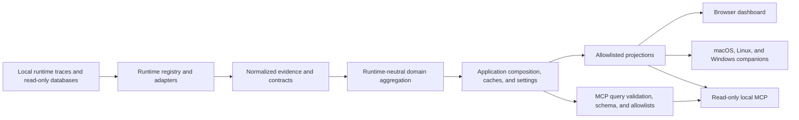

# Token Meter Architecture

This is the canonical current engineering map for Token Meter. For product use,
start with the [README](../README.md). Coding agents must also read
[AGENTS.md](AGENTS.md) explicitly because agent instruction files do not live at
the repository root.

## System at a Glance

Token Meter is a local, dependency-free Python service with a browser dashboard
and native companions. It discovers evidence created by supported coding-agent
runtimes, converts runtime-specific records into common usage concepts, and
exposes only bounded projections to each client.

The server binds to `127.0.0.1:8722`. `meter.py` is intentionally only an
executable and import-compatibility facade; current composition lives in
`token_meter/app.py`.

## Responsibility Boundaries

| Area | Owner | Responsibility |
| --- | --- | --- |
| Runtime identity and discovery | `token_meter/runtimes/` | Find sources, compute revisions, read inputs safely, parse runtime formats, and return normalized evidence. |
| Shared evidence contracts | `token_meter/contracts.py`, `token_meter/compat.py` | Keep runtime, model provider, account provider, source locator, availability, and provenance distinct; preserve bounded compatibility shapes. |
| Usage and analytics | `token_meter/domain/` | Calculate costs, timing, throughput, tools, insights, daily/model/session aggregates, and evidence coverage without runtime dispatch. |
| Model identity and prices | `token_meter/models/` | Resolve provider-scoped model names and effective-dated prices. |
| Provider limits | `token_meter/quotas/` | Make bounded, read-only account-usage requests and normalize available quota windows. |
| Operating-system behavior | `token_meter/platforms/` | Own host paths, process policy, updates, service integration, and recoverable trash behavior. |
| Application lifecycle | `token_meter/app.py`, `token_meter/services/` | Compose registries, manage caches/settings/watchers, and serve application jobs. |
| Public projections | `token_meter/projections.py` | Allowlist fields for session, state, model, menu-bar, and MCP consumers. |
| MCP query layer | `token_meter/mcp/` | Validate filters, bind opaque cursors to query revisions, positively allowlist standardized and native-structure fields, aggregate metrics, and publish schema metadata. |
| HTTP transport | `token_meter/web/`, `page.html` | Serve the loopback API, routes, actions, and the single-file dashboard. |
| Native clients | `menubar/`, Windows scripts | Render the compact `/menubar` payload and delegate deep review to the browser. |
| Local MCP | `token_meter_mcp.py` | Return bounded read-only current-run or aggregate evidence over stdio. |
| Packaging | `runtime-manifest.txt`, `token_meter/packaging.py`, `scripts/` | Stage one manifest-owned runtime and install platform-native lifecycle components. |
| Telemetry mapping | `token_meter/telemetry/` | Produce a pure OpenTelemetry-shaped mapping from an immutable privacy projection; perform no export or I/O. |

## Identity Axes

Four identities are deliberately independent:

- A **runtime** produced local evidence: Claude Code, Claude Desktop, Codex,
  Cursor, OpenCode, Kiro, or Pi.
- A **model provider** owns a model and its public pricing, such as Anthropic or
  OpenAI.
- An **account provider** may expose quota information through the user's
  existing sign-in.
- A **platform** owns operating-system paths, lifecycle, native UI, and trash
  semantics.

Shared domain, service, and client code must not infer one axis from another or
branch on runtime names. Identical model strings from two runtimes remain two
model-runtime histories.

## Runtime Adapter Lifecycle

Each registered adapter implements the same conceptual lifecycle:

1. **Discover** bounded `SourceLocator` values from platform-provided roots.
2. **Revise** each source with the minimum files or database rows needed to
   invalidate its cache correctly.
3. **Load** inputs read-only and degrade safely when optional enrichment is
   missing, busy, corrupt, or from an unknown schema.
4. **Normalize** session identity, usage, timing, tools, availability, and
   provenance without returning prompt or response content.
5. **Project** compatibility dictionaries only through explicit allowlists.

Runtime-specific formats stay in the adapter. Cross-session aggregation never
reopens raw traces; it consumes cached summaries. OpenCode database access and
Cursor shared-state enrichment are query-only. Claude Desktop joins metadata to
its authoritative trace rather than counting a second session.

Codex child rollout files may copy an exact prefix of a direct parent's
execution history. The Codex adapter keeps physical and logical identities
private, resolves only one unique cycle-free direct parent, and removes exact
model-and-numeric-usage prefixes before native load, legacy detail, or legacy
summary parsing. Ambiguous lineage retains all evidence. Runtime-neutral
aggregation never reopens traces or performs a second deduplication.

The Pi adapter reads only Pi-owned JSONL session files and accepts a source only
when it has the expected Pi session header. It projects recorded usage, local
cost, structural tool evidence, and inferred user-to-assistant wait intervals
without exposing message content. It uses a generic session title and collapses
account-bearing provider resources, including application-profile references,
to a safe model label. Pi does not establish a context window, output pace,
semantic token split, or cache-savings price, so those projections remain
unavailable rather than being derived or reported as zero.

## Domain and Model Flow

`token_meter/domain/usage.py` and `token_meter/models/` resolve token counts,
effective-dated prices, estimates, availability, and provenance. Timing and
throughput live in `domain/timing.py`; tool/capability evidence in
`domain/tools.py`; derived guidance in `domain/insights.py`; and cross-session,
daily, model, language, and tool aggregation in `domain/aggregates.py`.

Exact totals are not truncated. Lists used for workload shape, pace matching,
UI previews, or response-size control are bounded and must disclose their
scope. Missing evidence stays unavailable instead of becoming zero. Cursor
local token/cost proxies and API-equivalent costs retain estimate labels.

Model prices are provider scoped and effective dated. An ordinary new model is
catalog data; it should not require a runtime adapter or client change. Longest
valid prefix matching and historical price boundaries are compatibility
contracts.

## Application State and Caching

`token_meter/app.py` composes runtime, quota, and platform registries and owns
the background watcher. Runtime revisions invalidate only affected source
summaries. Cross-session state is reused by `/state`, `/session`, Models, Daily,
Tools, the menu bar, and MCP instead of being recomputed per request.

Filesystem modification time is a revision signal, not automatically user/model
activity. Adapters derive semantic activity from trace events or authoritative
metadata so merely opening a historical session does not promote it into
Current sessions.

Codex token fingerprints are compact, content-free, and held in a bounded
in-memory LRU. A child's lineage revision distinguishes unresolved from
resolved parentage and uses the direct parent's stable filesystem identity.
Parent appearance or replacement invalidates the child; append-only parent
growth does not invalidate an unchanged child summary.

Settings use bounded validation and atomic JSON replacement. Browser-local
navigation and presentation preferences remain in local storage. Mutation
routes require a local origin plus the current action token and accept only
allowlisted fields or discovered canonical identifiers.

## Client Interfaces

The browser polls live state and renders all top-level review surfaces from
`page.html`. Dashboard order is `Sessions → Spend → Models → Efficiency → Git →
Learn → Tools → Settings`; Sessions owns Current and All session modes. Efficiency derives
mechanical token-efficiency ratios and daily trends from the same runtime-scoped
model aggregates. Its sortable model table defaults to spend descending and
preserves unavailable and partial evidence. A Claude thinking-block observation
is projected only as a bounded execution count; it never substitutes total
output for an unavailable thinking-token split. The selected-session Run surface
reuses those same aggregate formulas for a compact Output/$ and Reasoning ratio
module. `/session` projects that selected source's bounded model statistics
directly, so older All Sessions entries do not depend on the 60-row cross-session
preview. Charts and model comparison remain on the top-level Efficiency route.
Git reads bounded local remote-tracking reflogs. The installer seeds
readable history in its invoking app's context, then the background service
rechecks accessible repositories every five minutes. This preserves useful
history when a macOS LaunchAgent lacks access to a protected folder without
requesting broader permission. The service matches `update by push` entries to
the repository's effective Git email, deduplicates hashed object identities,
and aggregates a date-bounded 12-month maximum of numeric text additions and
deletions against project/day covered spend. The public projection also joins
already-aggregated daily output and reasoning totals to expose Output / $,
pushed lines per 1K covered output tokens, spend-weighted coverage, and a
trailing seven-day cost-intensity series. This association stays at
project/day and selected-period scope; it does not attribute pushed code to a
session or model. Public project discriminators use the ledger's per-machine
salt. Clearing the ledger establishes a timestamped baseline so older reflogs
do not repopulate it. The service does not contact remotes.

The Git page's Delivery economics surfaces are derived in the browser from that
same projection; they add no field, endpoint, or stored state. Ranked signals,
daily distributions, and the day cost map are pure functions over the returned
days, project rows, availability flags, and comparison values. Coverage
exploration and project evidence filters classify those flags as comparable,
spend only, Git only, or unavailable without changing the underlying payload.
The daily chart, cost map, and actionable signals share a transient selected-day
state. Per-day ratio insights require a minimum pushed-line denominator so a
near-zero day cannot present a meaningful distribution value; those days remain
visible as explicitly low-volume context points. Fewer than five qualifying days
use an observed range rather than interpolated quartiles, and a measure without
qualifying days renders as unavailable rather than zero. Period ratios remain
conditional on comparable projects and are not described as lower or upper
bounds.

Native companions never parse traces. macOS AppKit, Linux AppIndicator, and
Windows NotifyIcon clients read the compact `/menubar` projection and use the
runtime catalog for generic labels, colors, and capabilities. Provider quota
views use cached normalized windows; unavailable is never rendered as 0%.

The optional MCP server is local stdio, read-only, and independently bounded.
Its decision tools use caller-matched or aggregate projections. Its `sessions`,
`trace`, `stats`, and `schema` query tools select content-free session IDs, read
one standardized or sanitized-native trace, aggregate only standardized
evidence, and describe their schema. Opaque
cursors bind the normalized query to the source revision, and serialized pages
are capped at 65,536 bytes. Native structure is not raw trace content: adapters
attach only constant structural types/subtypes and the shared projection keeps
an explicit allowlist of numeric, enum, model, and tool fields. Data returned to
a connected coding agent may enter that agent provider's model context under
the client's own terms.

## Privacy and Security Invariants

No public HTTP, native, MCP, or telemetry projection may contain:

- prompts, responses, reasoning, or message text;
- tool arguments, tool results, or raw provider responses;
- credentials, cookies, account tokens, environment values, or settings;
- local trace/database paths or raw exceptions;
- unbounded trace rows or provider-controlled payloads.

Provider quota checks are the only bounded network exception: each adapter uses
the matching provider credential, fixed HTTPS endpoints, timeouts, response
size limits, sanitized errors, and in-memory caching. No credential is copied to
Token Meter storage or another provider.

Git performs no network operation. Its SQLite ledger contains only salted
repository/object keys, local observation timestamps and days, numeric text-line
totals, and coverage state. Project paths, remote/ref names, Git identity,
messages, filenames, diffs, raw object IDs, command output, and exceptions are
never persisted or projected. Missing Git, identity, repository access, or
reflog history remains partial or unavailable.

`token_meter/telemetry/` is mapping-only. It contains no OpenTelemetry SDK,
exporter, collector address, socket, file sink, subprocess, or background
setting. Adding export is a separate privacy and dependency decision.

See [SECURITY.md](SECURITY.md) for reporting and operational details.

## Packaging and Platform Lifecycle

`runtime-manifest.txt` is the single source-to-runtime contract. `required` and
`optional` files are explicit; `python-tree` and `tree` entries expand owned
directories safely. `token_meter.packaging` validates paths before staging and
byte-compares every expanded source file afterward.

The public installer dispatches by host:

- macOS stages under `~/Library/Application Support/Token Meter/runtime` and
  manages `com.token-meter.server` plus `com.token-meter.menubar` LaunchAgents;
- Linux stages under `${XDG_DATA_HOME:-~/.local/share}/token-meter/runtime` and
  manages server/tray `systemd --user` services;
- Windows stages under `%LOCALAPPDATA%\Token Meter\runtime` and manages the
  current-user Run entry plus hidden server and WinForms tray launchers.

Installers are per-user, idempotent, and never require `sudo` or security-control
workarounds. Source-only success is insufficient for runtime changes: install,
check endpoints/services, and prove manifest parity.

## Extension Budgets

### Add a runtime

Expected changes are one adapter under `token_meter/runtimes/`, one descriptor
and registry entry, sanitized fixtures/tests, and model-provider catalog data
when needed. Shared domain, transport, dashboard, and native clients must remain
free of runtime-name branches.

### Add an operating system

Expected changes are one `PlatformServices` implementation, platform-native
installer/startup/update/uninstall helpers, one native compact client, manifest
contracts, and target-host lifecycle tests. Runtime parsers and domain logic
must remain untouched.

### Add a model or price

Ordinary additions change `token_meter/models/catalog.py` and exact pricing
tests. Add a resolver only when matching semantics differ. Never fall through
to a different provider's table.

### Add a quota provider

Add one bounded request/parser adapter and register its canonical account
provider ID. Local usage must continue when the capability is absent or fails.

### Add telemetry fields

Extend the privacy allowlist first, map only the immutable aggregate, and add
adversarial privacy plus no-I/O tests. Export remains out of scope until
separately approved.

Detailed contributor recipes and commands are in
[CONTRIBUTING.md](CONTRIBUTING.md) and [AGENTS.md](AGENTS.md).

## Validation Layers

1. Runtime and domain unit tests cover parsing, normalization, availability,
   pricing, timing, and aggregation.
2. Contract tests protect registries, architecture guards, public projections,
   privacy, packaging, platforms, and telemetry mapping.
3. Integration tests preserve compatibility and application composition.
4. Embedded JavaScript, Python, shell, PowerShell, and Swift syntax/compile
   checks protect each delivery surface.
5. Visible dashboard changes require wide-desktop and 1024-pixel-laptop browser checks. Phone, tablet, and sub-1024-pixel layouts are outside the supported product target.
6. Runtime changes require installation, `/health`, `/menubar`, platform service
   state, loopback listener ownership, installed revision, and manifest parity.

Run the exact current commands from [AGENTS.md](AGENTS.md).
