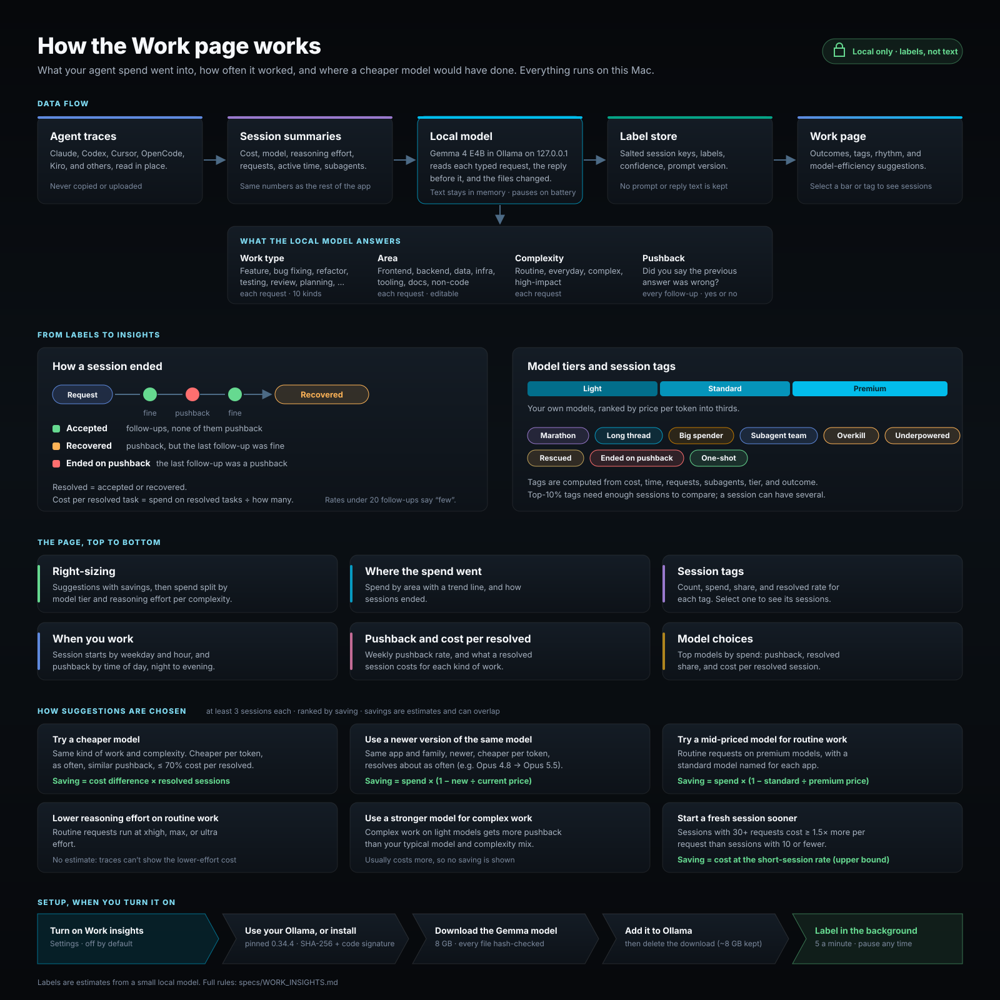

# Work insights: how it works

The current reference for the Work page logic. The
[design log](2026-09-30-work-insights-design.md) records why each piece
changed, iteration by iteration; this page describes what the code does now.
Constants named here live in `token_meter/domain/work.py` (aggregation and
suggestions), `token_meter/domain/work_evidence.py` (per-request cost and
action evidence), `token_meter/services/work_insights.py` (classifier), and
`token_meter/services/work_setup.py` (setup).

## 1. Setup (macOS only)

Work insights are off by default and supported on macOS only
(`work_insights_supported()`). Turning them on starts `WorkSetup` in the
background; it also runs at server start while enabled.

1. **Find Ollama.** If the configured URL (default `http://127.0.0.1:11434`)
   answers with Ollama 0.34 or newer, it is reused. If an Ollama is installed
   (`CLI_CANDIDATES`, including `~/Applications`) but not answering, setup
   waits two minutes, then stops with `ollama_offline` rather than replacing
   it. An Ollama older than 0.34 is bypassed in favor of the managed runtime.
2. **Otherwise install the pinned runtime.** Ollama 0.34.4 `ollama-darwin.tgz`
   from GitHub, checked against its pinned size and SHA-256, extracted with
   path checks (regular files with `O_EXCL|O_NOFOLLOW`, modes masked to 0755,
   same-folder symlinks only), and every Mach-O file must pass
   `codesign --verify --strict` with Ollama's Developer ID team `3MU9H2V9Y9`. It lives in
   `~/Library/Application Support/Token Meter/ollama/0.34.4` and runs as
   LaunchAgent `com.token-meter.ollama` on `127.0.0.1:11435` with logs sent to
   `/dev/null`. The settings URL then points there.
3. **Get the model.** If the model (`token-meter-winnow`) is missing, three
   pinned files of [Winnow-E4B](https://huggingface.co/EldanRing/Winnow-E4B)
   (`LICENSE`, `NOTICE`, and `gguf/Winnow-E4B-Q8_0.gguf`, about 8 GB) are
   downloaded from Hugging Face at commit `aabbd52f`, each checked by size and
   hash, with resume. Free space must cover the remaining download plus
   Ollama's copy of it (about 17 GB at first). The GGUF is imported as is with
   `ollama create`, then the download is deleted. In Token Meter's own Ollama,
   the retired `token-meter-jet` model is removed afterwards; a user's own
   Ollama keeps every model it has. Saved settings that still name
   `token-meter-jet` read as `token-meter-winnow`, but the new download does
   not start on its own: the Work page explains the new model and waits for
   **Retry setup**. Turning Work insights on or choosing a different model
   also counts as agreement; a pause, pace, history, area, or notification change keeps
   the retired name so setup keeps asking. Saving `token-meter-jet` is
   refused. The Modelfile carries the license and notice text, so they
   stay with the model after the download is deleted; uninstall also removes
   partial `winnow-e4b-*` downloads.

Loopback probes never use an HTTP proxy. Turning Work insights off cancels a
running setup at its next checkpoint and stops the managed Ollama; turning it
back on while the old run winds down restarts setup only if it is still on.
Status exposes a state, a reason code, byte counts, whether the Ollama is
managed, and the pinned version; no paths or error text. Uninstall removes
the managed Ollama, its model, and leftover setup downloads.

## 2. Requests: cost and what happened

Work is measured per **request**: one typed request and everything the agent
did until the next one. When a session is parsed (and Work insights are on),
each runtime adapter hands `attach_work_requests` its typed turns, its priced
assistant events (time, cost, model, effort), and, for Claude and Codex, its
tool calls (`claude_work_actions`, `codex_work_actions`, including tools
called from Codex code-mode scripts).

- **Cost split** (`request_slices`): an event belongs to the latest request
  that started at or before it (resumed traces can list requests out of
  order, so ownership goes by time). Cost before the first request goes to the
  first. A request's model and effort are the ones that cost the most in its
  slice. Cursor uses each execution's cost; OpenCode each message's.
  Without timestamps, each day's cost is spread over that day's requests.
- **Evidence** (`evidence_text`): one line naming the files the agent changed
  for that request by basename ("Files the agent changed: page.html, app.py
  and 3 more."), or that it changed none or only committed or pushed. It goes
  to the classifier prompt in memory and is never stored. The row keeps only
  content-free slices: cost, model, effort, counts of tool kinds and command
  kinds (test, git, build, deploy, ...), and file categories (frontend,
  backend, docs, ...). Cursor and OpenCode get cost slices but no file names
  (their summaries keep only tool names, or no per-message tool timing).

## 3. Classification

The classifier queue (bounded, 256 items) receives each request's text,
the earlier substantive request in the session (first 400 characters), the
last 600 characters of the preceding assistant reply, and the evidence line.
Text is cleaned (runtime wrappers such as in-app browser context are dropped,
uploaded files become `[uploaded: name]`, interrupt markers are ignored),
compressed to a skeleton (at most 2,000 characters), and sent only to the
validated loopback Ollama URL. Only salted session and turn keys, labels,
confidences, prompt versions, taxonomy hashes, and the model digest are stored.

| Question | Asked of | Answer | Unclear below |
| --- | --- | --- | --- |
| Work type | every substantive request (3+ words) | feature, debug (bug fixing), refactor, test, review (code review), plan, explore (questions and research), ops (DevOps and setup), docs, other (non-software) | 0.35 |
| Area | every substantive request | one of 2-8 editable areas; defaults follow the stack: Frontend & UI, Backend & APIs, Data & ML, Infrastructure & DevOps, Developer tooling & agents, Docs & writing, Non-code | 0.4 |
| Complexity | every substantive request | routine, everyday, complex, high-impact (probability-weighted level against cut-offs 0.75 / 1.5 / 2.5) | — |
| Pushback | every follow-up turn | yes/no from four checks: the previous work was wrong; the user is unhappy with the last result, even mildly; the agent's change is not working or not visible; the user doubts or disagrees with the assistant | — |

A short reply ("yes", "go on") is not labeled for work type, area, or
complexity; it keeps the labels of the request before it (requests before
the first label take the first label). Within a session the queue labels the
most expensive requests first.

Every question uses Winnow's native prompt: the state and the question go in
as JSON strings with lettered options, sent raw to `/api/generate`, and the
answer is read from the first token's top-20 log-probabilities (a letter
missing from them sits 3 below the lowest returned one; softmax temperature
1.2574). Area is asked first and its answer is added to the work-type state as
`Area of this request: …`. Complexity is the probability-weighted level, with
the levels starting at 0.75, 1.5, and 2.5 because the model spreads some
probability upward. Pushback sees the earlier request, the files the agent
changed in its previous turn, the reply tail, and the latest message; the four
checks' yes-probabilities are combined by a logistic fit (`PUSHBACK_WEIGHTS`,
decision at 0.43), and the stored confidence is centred on that decision.
Labels carry a per-question prompt version (`QUESTION_VERSIONS`, all `w1`);
changing one relabels only that question, and older labels keep showing
until replaced. Area labels count whenever their taxonomy hash
matches. Cutoffs apply when labels are read, so changing one needs no
relabeling. An area answer between 0.25 and the 0.4 cutoff is kept as a
**low-confidence guess** (`area_guess`): it counts in that area, and the bar
shows that spend lighter.

Sessions without a label fall in one of three groups, shown muted after the
areas: **No request text** (no typed request Token Meter can read, either
because the app does not record one in a readable form, as with Kiro and Pi,
or because the session never had one), **Outside labeling history** (last
active before the history setting), and **Not labeled yet** (waiting in the
queue). Only the last is real backlog; labeling progress counts only
labelable sessions.

The worker paces model calls (default 5 a minute; 5-60), pauses on battery,
waits when load exceeds 0.75 per CPU or the model slows 3x, and backs off when
Ollama is unreachable. A substantive follow-up takes seven calls (one each for
area, work type, and complexity, and four pushback checks), so relabeling a
long history at 5 a minute takes hours; a faster pace in Settings shortens it.
The model stays loaded while work is queued or backlog is ready to load, and
is unloaded from Ollama as soon as nothing is (and on pause or throttling),
so its memory is free whenever nothing is waiting.
History to backfill: 30, 90 (default), 365 days, or all.

## 4. From labels to outcomes

Three units, each used where it fits:

- **Requests** carry spend. Where the spend went, right-sizing, reasoning
  effort, and pushback over time add up requests. A request's *rework* is
  whether the request after it was a pushback.
- **Tasks** carry outcomes: a run of consecutive requests with the same kind
  of work. A task is judged from the pushback on its follow-ups and on the
  request that ended it: **accepted** (none), **recovered** (pushback, then
  not), **ended on pushback** (the last one was), or unjudged (no labeled
  follow-up). *Resolved* tasks are accepted or recovered. **Cost per resolved
  task** is the spend of resolved tasks divided by their count; model fit,
  the scorecard, and model-switch suggestions use tasks too.
- **Sessions** keep start time, duration, child runs, tags, and how they
  ended: **Single request**, **Accepted**, **Recovered**, **Ended on
  pushback**, **Unclear** (all low-confidence), or **Not labeled yet**. A
  session's headline area, work type, and complexity are the ones that cost
  the most across its requests.

Rates with fewer than 20 labeled follow-ups are marked "few".

**Model tiers** rank the models the user actually ran (each app's model counted
separately) by catalog output price into thirds: light, standard, premium.
Models without a catalog price get no tier. Complexity groups are
routine, everyday, and Complex+ (complex plus high-impact).

Requests and tasks count in the selected range (1 day, 1 week, 1 month, Month
(from the 1st, by day), 3, 6, 12 months, or all history) by the day they
happened; session modules (tags, how sessions ended, when you work) count
sessions *started* in the range.

## 5. Page modules

1. **Right-sizing** (first): three cards. **Model suggestions** shows the
   biggest single possible saving and the top three model suggestions by
   saving (newer version, cheaper model for a kind of work, premium on routine,
   light on complex). **Reasoning suggestions** shows routine requests on high
   effort and routine spend by effort. **Pushback** shows the share of labeled
   follow-ups that pushed back, a weekly trend (weeks with 10+ follow-ups), and
   the models with the least and most pushback (20+ follow-ups each). Under
   **View as tables**: every suggestion, spend split by model tier and by
   reasoning effort per complexity group, and the grid. Both charts use the same three
   validated hues, cheap to expensive: teal (light models; low–medium effort),
   blue (standard; high), and amber (premium; xhigh, max, or ultra). Effort is
   folded into those three bands for readability; the tables keep every level.
   Striped segments are mismatches:
   premium models or xhigh/max/ultra effort on routine work, or light models on
   complex work whose pushback rate is above the median cell.
2. **Where the spend went**: spend by area, split by request, with a
   sparkline per area (three or more buckets), and how sessions ended.
3. **Session tags** (computed, not from the model; a session can have several):

   | Tag | Rule |
   | --- | --- |
   | Marathon | active time at least 1 hour, and in the top 10% when 10 or more sessions have a duration |
   | Long thread | 30 or more requests |
   | Big spender | cost in the top 10%; needs 10 or more priced sessions |
   | Subagent team | 3 or more child runs (agent `parent_id` chains) |
   | Overkill | more than half the session's spend is routine requests on a premium model or xhigh/max/ultra effort |
   | Underpowered | a complex task on a light model that got pushback |
   | Rescued / Ended on pushback / One-shot | the outcome above |

   "Top 10%" means strictly above the 90th-percentile value of the period.
4. **When you work**: session starts by local weekday and hour, and pushback
   rate by time of day (night, morning, afternoon, evening). The comparison
   line needs two bands with 20 or more labeled follow-ups.
5. **Pushback over time** (weekly; daily for short ranges, optionally per
   model) and **Cost per resolved task** by kind of work.
6. **Model choices**: top eight models by spend with pushback, resolved share,
   and cost per resolved task; the lowest is marked when at least two models
   have five or more judged tasks.

Bars, outcome rows, tags, table rows, and suggestions open the sessions behind
them (`/work/sessions`, the same filters and windowing as the aggregate). A
request filter (area, kind of work, complexity, tier, effort, model) lists
sessions with any matching request, ranked by the matching spend. The rhythm
heatmap and time-of-day bands do not open sessions.

## 6. Suggestions

Right-sizing cells need at least 3 requests, and the model suggestions have
the higher floors below (in tasks). Suggestions are ranked by estimated saving, then
spend, and capped at 8. Savings are estimates and can overlap.

| Suggestion | When | Estimated saving |
| --- | --- | --- |
| **Try a cheaper model** for one kind of work at one complexity level | Compared with the most-used model in that cell (Unclear work types skipped). The alternative is cheaper per token, resolves within 5 points as often, gets no more than 5 points more pushback, and costs at most 70% per resolved task; the current model has 10+ judged tasks there, the alternative 5+; routine work is never pointed at a premium model. If the alternative has never been used on harder work, the suggestion says to keep the current model for it | (current − alternative cost per resolved task) × current resolved tasks |
| **Use a newer version of the same model** | Same app and family, strictly newer version, cheaper per token, resolves within 5 points as often overall; 10+ judged tasks on the current model, 5+ on the newer | current spend × (1 − new price ÷ current price) |
| **Try a mid-priced model for routine work** | Routine requests ran on premium models; names them and, per app, the most-used standard model there | spend × (1 − median standard price ÷ median premium price) |
| **Lower reasoning effort on routine work** | Routine requests used xhigh, max, or ultra effort | none (no counterfactual cost) |
| **Use a stronger model for complex work** | Complex+ on light models with pushback above the median cell (20+ labeled turns) | none (usually costs more) |
| **Start a fresh session sooner** | Sessions with 30+ requests cost at least 1.5x more per request than sessions with 10 or fewer (5+ priced sessions each) | long-session spend − long requests × short-session cost per request (upper bound) |

Model families drop version numbers, vendor or region prefixes, `[1m]`-style
markers, `-v1:0`, and date stamps (`claude-opus-4-8` and `claude-opus-5-5` are
both `claude-opus`, versions `(4, 8)` and `(5, 5)`).

## 7. Live suggestions and notifications

Each running session on **Sessions → Current sessions** can show up to three
suggestions (`live_session_hints`), computed when the live state refreshes from
its latest labeled request and the model it is using now:

| Suggestion | When |
| --- | --- |
| Two pushbacks in a row | the last two confidently labeled follow-ups were pushback |
| Complex work on a light model | Complex+ request on a light-tier model that has had pushback in this session (a per-session check, looser than Right-sizing's median rule) |
| Routine request on a premium model | routine request on a premium-tier model; names the app's most-used standard model |
| High reasoning effort on routine work | routine request at xhigh, max, or ultra effort |
| Long session | 30 or more requests so far |

The first four need Work labels; the long-session check works without them.
Model-switch advice that needs outcome evidence (a cheaper or newer model)
stays in Right-sizing. A resumed session uses its newest trace file.

The menu bar gets the same suggestions as `live_hints` (stable id, title, and
body naming only the app and model) and sends one notification per suggestion
for each running session, remembering the last 200 ids. Notifications are
sent only while Work insights are on and **Notify me about live suggestions**
is checked (`live_notifications`, on by default within Work insights). The
first poll after installing only records what is already showing.

## 8. Limits

- Labels come from a 4B local model and are estimates; misclassified
  complexity or work type moves a session into the wrong comparison.
- Even within one complexity level, a cheaper model may have handled easier
  requests; a switch suggestion is something to try, not a guarantee.
- Suggestions shift while relabeling runs.
- Accuracy on 120 real local requests (2026-10-05, blind gold labels, see the
  design log): work type 79%, area 85% (79% and 92% weighted by cost),
  against 50% and 61% when every request took its session's first label.
  Complexity was not measured. The set is small and the format was chosen on
  it, so treat these as rough.
